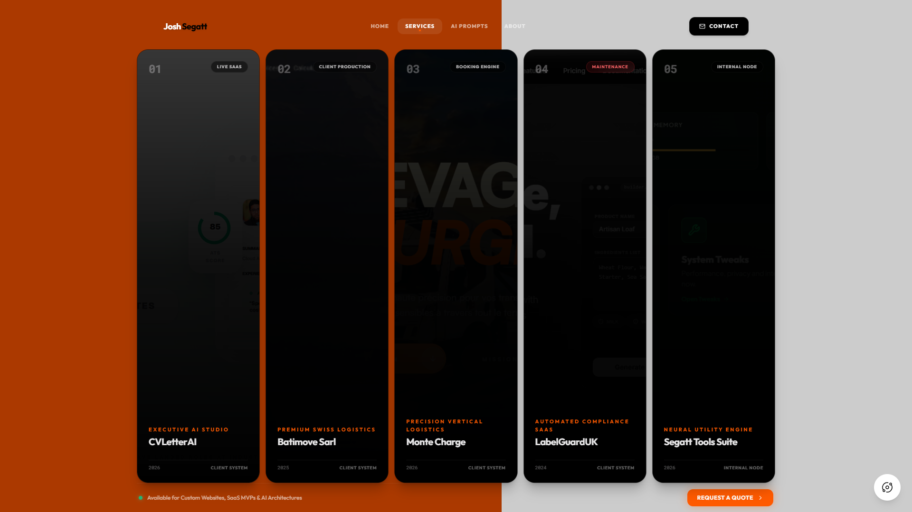
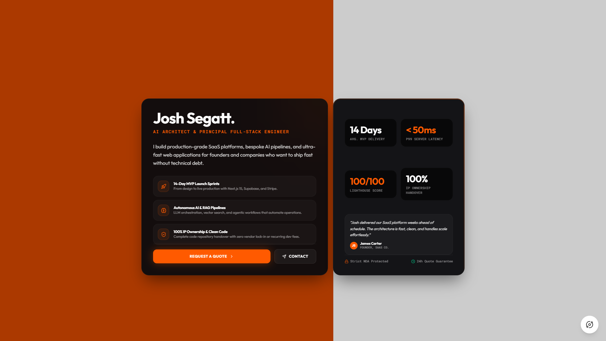

# JOSH SEGATT — Principal AI Software Architect & Full-Stack Engineer

<p align="center">
  
</p>

<p align="center">
  <a href="https://segatt.com"><strong>Explore Live Portfolio</strong></a> ·
  <a href="mailto:contato@joshsegatt.com"><strong>Request a Quote</strong></a> ·
  <a href="https://linkedin.com/in/joshsegatt"><strong>LinkedIn Profile</strong></a>
</p>

<p align="center">
  
  
  
</p>

---

## ⚡ Executive Overview

London-based **Principal AI Software Architect & Senior Full-Stack Engineer** specializing in production-grade SaaS platforms, autonomous AI/RAG pipelines, and ultra-fast web systems for founders and companies who want to ship fast without technical debt.

- 🚀 **14-Day Rapid MVP Sprints:** Complete turnaround from concept to production-ready SaaS with Next.js, Supabase, and Stripe.
- 🧠 **Autonomous AI & RAG Orchestration:** Bespoke LLM agents, vector search pipelines, and enterprise automation workflows.
- 🔒 **100% IP Ownership & Clean Code:** Full repository handover with zero vendor lock-in or recurring maintenance fees.
- ⚡ **Zero-Latency Performance:** P99 sub-50ms server responses, 100/100 Lighthouse performance metrics.

---

## 💎 Project & Studio Showcase

| **01. Brand Split Hero (Fixed Viewport)** | **02. Interactive Services & Client Solutions** |
|:---:|:---:|
|  |  |
| *Signature 55% Orange / 45% White Split Layout.* | *Interactive hover mosaic with live production SaaS.* |

| **03. AI Prompt Engineering Canvas Studio** | **04. Executive About & Conversion Dossier** |
|:---:|:---:|
|  |  |
| *Claude 3.7 & Vibe Coding spec synthesizer with 3D Cyber Bot.* | *High-contrast obsidian glass with 14-day turnaround guarantee.* |

---

## 🛠️ Tech Stack & Architecture

- **Frontend & UI:** React 19, TypeScript, Tailwind CSS v4, Framer Motion, Three.js / React Three Fiber (`@react-three/drei`).
- **AI & Reasoning Engines:** Google Gemini AI API, Claude 3.7 Sonnet, OpenAI o1/GPT-4o, Cursor AI Agent Specs.
- **Backend & Cloud Services:** Node.js, Express, Supabase (PostgreSQL), Stripe API integration, Resend / EmailJS.
- **SEO & Performance Suite:** Schema.org JSON-LD structured data (`Person`, `ProfessionalService`), Geotargeting (London/UK/Europe), XML Sitemap, Robots.txt.
- **Deployment & Hosting:** Optimized for instant zero-config deployments on **Vercel** with full SPA rewrite routing.

---

## 🚀 Getting Started Locally

```bash
# 1. Clone the repository
git clone https://github.com/Joshsegatt/profile.git
cd profile/my-profile

# 2. Install dependencies
npm install

# 3. Start local development server
npm run dev

# 4. Build for production (Vercel)
npm run build
```

---

<p align="center">
  <small>© 2026 JOSH SEGATT. All rights reserved. Designed & Engineered for High-Growth Digital Products.</small>
</p>
