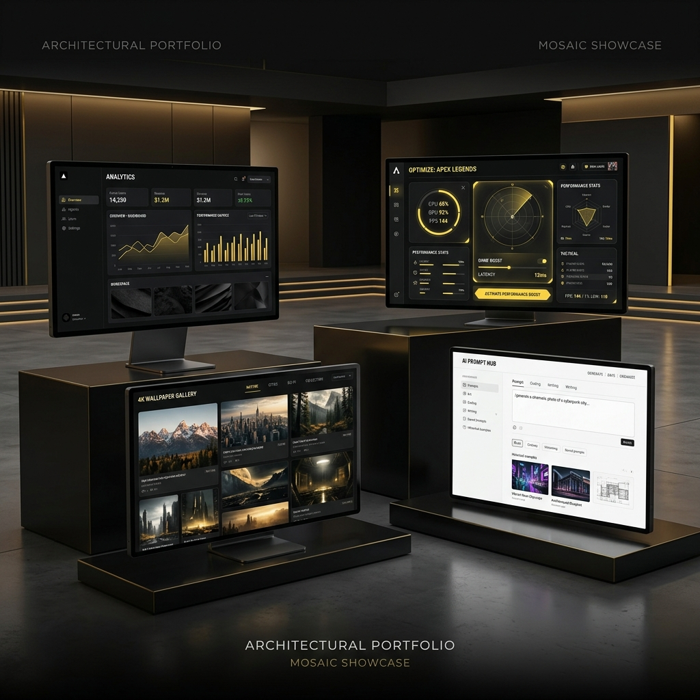

# Obsidian Nexus — Professional Digital Instrument



## 🌌 The Vision
**Obsidian Nexus** is not just a portfolio; it's a high-fidelity digital instrument engineered for the modern web. Built with a focus on **Atmospheric UX** and **Technical Excellence**, this platform synthesizes four distinct digital ecosystems into a single, cohesive experience.

From high-performance SaaS interfaces to low-latency gaming optimization systems, every pixel is tuned for maximum impact.

---

## 💎 Core Ecosystems

### 1. Monte-Charge SaaS Dashboard
A Swiss-engineered logistics management interface.
- **Obsidian Design System:** A custom-built UI framework using glassmorphism and monochrome aesthetics.
- **Data Visualization:** Real-time metrics and vertical logistics tracking.
- **B2B Localization:** Full multi-language support (English, Portuguese, French) for international markets.

### 2. Gamer Optimizer (LUMEN_SYNC)
A tactical performance suite for competitive gamers.
- **Low-Latency Architecture:** Engineered for 60FPS+ UI responsiveness.
- **Technical Analysis:** Interactive hardware optimization flows with PowerShell generation for Windows performance tuning (FPS/Network/Thermal).
- **Tactical Aesthetic:** High-contrast yellow accents inspired by Unreal Engine 5 and tactical military HUDs.

### 3. Wallpaper Hub (4K NODE)
A high-performance media delivery engine.
- **Aggressive Pre-fetching:** Background caching logic for instantaneous category switching.
- **Multi-Proxy Resiliency:** Fallback systems (AllOrigins/CORSProxy) ensuring 100% uptime for asset delivery.
- **Adaptive Grid:** Device-aware layout switching (Mobile/Desktop) without layout shift.

### 4. AI Prompt Hub (GEN_ASSET)
A curated gallery of high-fidelity generative prompts.
- **Editorial UX:** A clean, minimal layout focused on visual clarity and asset copying.
- **Cinematic Lightbox:** High-performance media viewing system using `createPortal` and Framer Motion.
- **Curated Assets:** 12+ premium AI prompt nodes with model-specific metadata.

---

## 🛠️ Technical Stack

- **Framework:** [React 18](https://reactjs.org/) + [Vite](https://vitejs.dev/)
- **Styling:** [TailwindCSS](https://tailwindcss.com/) (Atomic CSS Architecture)
- **Animations:** [Framer Motion](https://www.framer.com/motion/) (Shared Layout Transitions & Physics-based Motion)
- **Navigation:** [React Router 6](https://reactrouter.com/) (Instantaneous Route Handling)
- **Icons:** [Lucide React](https://lucide.dev/)
- **Performance:** Custom Caching Layer + AbortController API for network resilience.

---

## ⚡ Engineering Highlights

### **Instantaneous Navigation**
By refactoring the routing structure to handle location state at the top-level and eliminating staggered entrance delays, the platform achieves "Zero-Lag" perception. 

### **Shared Layout Animations**
The navigation system uses Framer Motion `layoutId` to synchronize pill movements between routes, creating a "software-like" feel rather than a traditional website.

### **Internationalization (i18n)**
A custom-built, lightweight i18n utility that handles nested JSON structures and dynamic parameter injection without the overhead of heavy external libraries.

---

## 🚀 Getting Started

### Prerequisites
- Node.js 18+
- npm / pnpm / yarn

### Installation
```bash
# Clone the repository
git clone https://github.com/your-username/my-profile.git

# Enter the directory
cd my-profile

# Install dependencies
npm install

# Start the dev server
npm run dev
```

---

## 📜 License
Proprietary License. All rights reserved. Designed and Developed by **Josh Segatt**.
